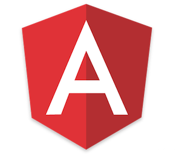
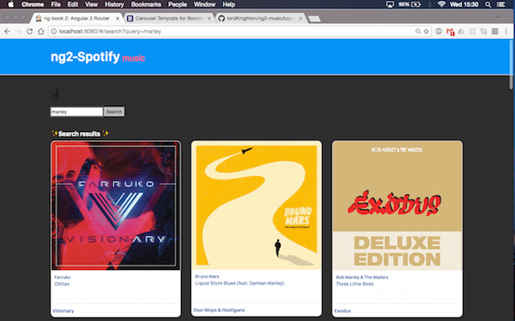

# ng-book 2: Routing - Music

## Quick start

```bash
# install 
npm install

# run
npm run go
```

Then visit [http://localhost:8080](http://localhost:8080) in your browser. 


## Demo



:construction: still in progress
I'm gonna add an about page & update the style to a
sleek dark background & color buttons
and update the navbar color & style.

getbootstrap.com
